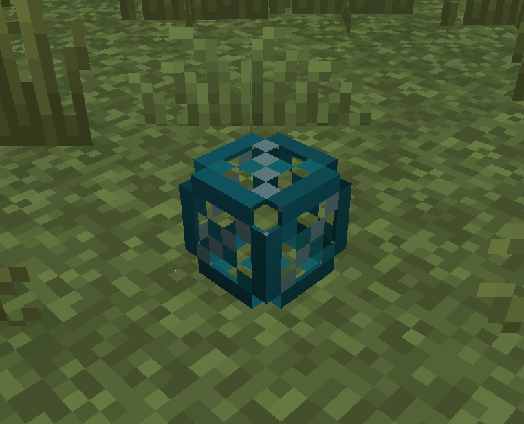

> 感谢闽高联 AB 帮助我将这篇教程转移至Github Repository
> 本教程作者 某个草 ，原文位置 https://hi-ysumc.feishu.cn/wiki/QDJBwtCBEi5eLakfWCvcRtErnvb?from=from_copylink 请勿二次转载。

# 游戏内编辑功能（Builder Mode）

# 附加菜单及其功能介绍

当玩家物品栏的选择光标不在“功能”栏位上时，按住 `LAlt` 键，可以呼出 Axiom 的创造模式附加菜单，松开 `LAlt` 键菜单即关闭。

> [!TIP]
> 在任何游戏模式下，只要“允许作弊”选项为开，按下 `LAlt` 键，均会呼出附加菜单，并切换为创造模式。

Axiom4.0.0 版本的创造模式附加菜单构成如下：

## 左栏设置（由上到下介绍）

### 穿块模式

开启后，当玩家处于飞行模式下时将无视方块碰撞箱（类似于旁观模式）。
当玩家关闭飞行模式时，方块碰撞箱会恢复。

### 凭空放置

开启后，玩家可以直接在空气中放置方块。
方块放置光标会变成半透明的方块。

### 快速放置

开启后，玩家可以无视创造模式方块放置的时间间隔（约 0.26 秒）快速放置方块。

### 无限触距

开启后，玩家可以无视方块最大放置距离，在自己给定的距离限制放置方块。
**可在“工具箱”中调节你想要的放置距离限制**，范围是 5~100 方块，100 方块后是“无限制”。
方块放置光标会变为粗线，以方便确定放置位置。

### 调整模式

开启后，你可以空手右键具有属性的方块以改变其方块的部分属性，类似调试棒。
调整模式相较于调试棒更为灵活，可以更加直观地进行调试，非常适用于雕花工作。

### 冻结方块更新

开启后，方块将不再更新（例如开门时只开十字准星指的一边，沙子砂砾不掉落等）。

### 强制放置

开启后，方块将无视放置限制，强行放置。

> [!TIP]
> 强制放置的方块有可能会因为周边方块更新而掉落（例如种在基岩上的花旁边多了朵新的花），所以“强制放置”建议结合“冻结方块更新”一起使用。
> 

### 替换模式

默认键位为 `R`，开启后，方块放置光标会变成半透明的方块，以替换玩家指向的方块。放置后，玩家指向的方块将直接替换为放置的方块。
**可在“工具箱”中打开“类型替换”。**在“类型替换”打开的情况下，使用**新材质的整方块**来替换**前材质的变种方块时**（如台阶，楼梯，活板门等）时，会直接替换成新材质的变种方块而非新材质方块本身。

### 快速破坏

开启后，玩家可以无视创造模式方块破坏的时间间隔（约 0.26 秒）快速破坏方块。

## 物品栏与备选物品栏

Axiom 现在可以支持无限页数【需要验证】的备选物品组，每页里有 9 个备选物品栏，你可以储存 9 个备选物品栏，**备选物品栏和生存模式物品栏不互通。**
打开附加菜单后，用鼠标滚轮选择一个栏位，则该栏位所在的备选物品栏则会替换掉玩家现在的物品栏，之前物品栏内的物品则进入备选物品栏。
可以通过鼠标点击来选择备选物品栏中的物品。
点击“飞行速度”滑块上方的“↑”“↓”可以切换物品栏页。
备选物品栏可以让你储存更多的建筑方块，从而避免在冗长的创造模式物品栏中寻找。

## 调节飞行速度

点击符号“+”“-”可以增或减 10% 的飞行速度，鼠标拖拽或点击可以精细调节飞行速度，调节区域为 100%~999% 的创造模式飞行速度，速度条上方有数字提示飞行速度。

> [!TIP]
> 可以通过编辑器模式手动输入飞行速度，从而调节到更高的飞行速度，该改动也会反映在游戏内。
> [!TIP]
> 飞行速度的调节是非常重要的一个功能。如果地图过大，更快的飞行速度可以更方便赶路。
> 

## 其他设置（工具箱）（由上到下介绍）

### 显示标记实体操作轴（Show Marker Entity Gizmo）

开关标记实体的操作轴。

详细描述请参看本知识库[《编辑器功能》](https://hi-ysumc.feishu.cn/wiki/MyT1wSLQ1ijz4FkMmiYc55twnNd?fromScene=spaceOverview)。

**标记实体是 Axiom 在进行选区后的一个可选项，仅有标记作用。**

### 显示展示实体操作轴（Show Display Enitity Gizmo）

开关展示实体的操作轴。

详细描述请参看本知识库[《展示实体编辑功能》](https://hi-ysumc.feishu.cn/wiki/R44JwAFvZilknukIhZBcgC9nnXR?fromScene=spaceOverview)。

**展示实体**是一种实体，详情见[此 wiki 页面。](https://zh.minecraft.wiki/w/%E5%B1%95%E7%A4%BA%E5%AE%9E%E4%BD%93)

### 显示操作轴键位提示（小贴士）（Show Key Hints）

开关展示实体操作轴的键位提示，位于游戏 HUD 右下角。

详细描述请参看本知识库[《展示实体编辑功能》](https://hi-ysumc.feishu.cn/wiki/R44JwAFvZilknukIhZBcgC9nnXR?fromScene=spaceOverview)。

### 可触及范围限制调节

调节玩家可以在创造模式中可触及到的距离，范围是 5~100，100 方块后是无限制。

### 按键显示

在游戏屏幕左下角显示玩家按下的键盘按键。

### 液体不透明度调节

调节液体不透明度，范围是 0%~100%，用来看清水下的情况。

### 最低亮度调节

调节最低亮度，范围是 0%~100%，用来在黑暗处看清结构，对超大比例建筑而言很有用。

### 类型替换

启用后，在“替换模式”下，使用**新材质的整方块**来替换**前材质的变种方块时**（如台阶，楼梯，活板门等）时，会直接替换成新材质的变种方块而非新材质方块本身。

> [!TIP]
> 例：在“类型替换”开启的情况下，使用磨制深板岩右键橡木台阶，会直接替换成磨制深板岩台阶。若“类型替换”关闭，则仅替换成磨制深板岩。

### 飞行模式（Flight Direction）

改变飞行时玩家的飞行模式。

- **Horizional：**经典的创造模式飞行。
- **Camera：**类似游戏引擎的漫游式飞行。

### 飞行动量调节

调节当玩家停止向某个方向飞行后的速度惯性，范围是 0%~100%

飞行动量越低，停止按方向键后速度归零越快，数值越低，其表现越类似基岩版的创造模式飞行速度惯性。

> [!TIP]
> 这个功能是防止飞行速度过快时玩家因为飞行惯性影响而对不准位置，这在部分可以调节飞行速度的服务器中经常发生。

## 创建展示实体（Create Display Entity）

详细描述请参看本知识库[《展示实体编辑功能》](https://hi-ysumc.feishu.cn/wiki/R44JwAFvZilknukIhZBcgC9nnXR?fromScene=spaceOverview)。

## 编辑方块属性（Edit Block Attributes）

编辑部分方块的属性，以方便进行建筑。

- **显示碰撞箱网格（Show Collision Mesh）：**显示非固体方块的碰撞箱，以红色边缘显示。

- **常显示光源方块（Show Light Blocks）：**显示光源方块位置，即便玩家手里没有拿着光源方块，其位置以方块显示。

- **常显示结构空位（Show Structure Void Blocks）：**显示结构空位位置，其位置以方块显示。

- **将准星判定框扩大到整方块大小（Expand Hitboxes to Full Cube）：**将一些非整方块的准星判定箱扩大，使其更容易被放置或破坏。

> [!TIP]
> 打开该功能后，非整方块的碰撞箱也会被扩大成整方块大小。

- **使液体方块可破坏（Make Fulid Hitboxes Solid）：**打开后，可以空手破坏液体方块，方便徒手随时破坏液体方块。

> [!TIP]
> 建议打开“冻结更新”后使用。

- **关闭互动（Prevent Interactions）:**打开后，当玩家持有方块时，会禁用方块的可互动选项（例如开关门，打开箱子等）。

# 选区编辑菜单

当玩家物品栏的选择光标在“功能”栏位上时，按住 `LAlt`，可以呼出 Axiom 的游戏内功能选择菜单，松开 `LAlt` 菜单即关闭，使用鼠标滚轮选择。

Axiom3.2.2 版本的选区编辑菜单构成如下：

## 放置对称点/轴（Setup Symmetry）

> [!TIP]
> 这个功能目前还不算是很好使。

右键点击，会在世界中放置一个对称点/轴。

对称中心标记初次放置时是一个灰色方块，**对称中心可放置位置的相邻的单位长度是 0.5 方块，也就是说对称中心标记可以放在方块面的正中心，边中点或顶点上。**

点击右键可以直接将对称中心标记放置在某个位置。

对称中心也可以使用鼠标滚轮进行位置微调，调节方向以玩家面朝的轴线方向为准（X,Y,Z）。

按下 `delete` 键，可以移除对称中心。

> [!TIP]
> **因为对称中心的微调需要用到鼠标滚轮，所以此时是无法使用鼠标滚轮切换手持物品的，只能使用数字“****0****~****9****”键来切出手持物品。**

### 轴对称模式

**使用 ****Ctrl****+****F**** 键可以打开一个轴对称模式。**创建轴对称方向由玩家面朝的轴线方向为准（X,Y,Z）。轴对称模式开启后，对称中心标记变为黄色，两侧出现一对顶点向外的圆锥体以标示对称方向。**此时放置方块时，对称轴另一侧也会出现同种方块，若方块带有方向类属性，则对侧会是该方块的轴对称方向版本。**

轴对称模式共有三种：X 轴对称模式，Y 轴对称模式和 Z 轴对称模式，三者均可独立开启关闭。

**当打开多种轴对称模式时，其最终轴对称结果由玩家面朝的轴线方向为准。**

> [!TIP]
> 例：打开多种轴对称模式时，假设面对的轴线方向正好是 X 轴对称模式的对称轴方向，则放置方块时优先进行 X 轴对称。

### 中心对称模式

**使用 ****Ctrl****+****R**** 键可以打开中心对称模式。**中心对称模式开启后，对称中心标记变为黄色，外侧出现环绕对称中心标记的两个绿色同心圆。**此时当放置方块时，方块会以 90 度 Y 轴方向中心对称排列，若方块带有方向类属性，则对称测会是该方块的中心对称方向版本。**

> [!TIP]
> **注意：中心对称模式并不等效于同时打开 X 轴对称模式和 Z 轴对称模式。**

中心对称模式可以与轴对称模式混合使用。**如果方块的对称生成有冲突，则优先以中心对称模式放置方块。**

> [!TIP]
> **对称模式的方块放置原理是“检测由玩家形成的方块更新”。也就是说任何由玩家形成的方块更新都会在对称模式上形成一个可能结果。**
> **即使作者有所预防（例如打开对称模式后拉杆和按钮均不可按动或拨动），但仍旧有所疏漏，例如在对称模式下调节红石中继器，会导致该中继器被对称过去等。**
> **该原理也会导致发生错误放置或破坏后进行修补时，可能会导致修补方块被对称过去，此时只有关闭对称模式才可正常修复。**

## 擦除工具

### 清除选区内容

> [!TIP]
> 该工具类似 WorldEdit 的 `//set 0` 指令。

左键点击一个方块打开 **清除选区内容** 模式，同时也会选择选区的第一个点，左键其他方块可以重新选择第一个点。

右键点击第二个方块以选择第二个点，右键其他方块可以重新选择第二个点。最终的选区将会是一个以左键点和右键点的连线作为体对角线的立方体。

鼠标中键点击一个选区外的方块可以扩展选区，扩展后的选区将是包含所有的目标方块的最小的立方体。

> [!TIP]
> 当 **清除选区内容 **模式打开时，输入 `//pos1`,`//pos2` 时也会进行选点操作，且相较于 WorldEdit 拥有更高的执行优先级。
> 其他需要选区的编辑功能亦是如此，不再赘述。

按下 `delete` 可擦除选区内方块。

使**用鼠标滚轮将光标移出或“功能”栏位或按下数字“****0****~****9****”键即可关闭擦除工具，同时选区会重置。**

### 清除同类连接方块

右键点击一个方块，在一定范围内擦除与**目标方块相同且与目标方块相邻**方块（不考虑方块属性）。

选区半径**遵循切比雪夫距离**，**一次操作最多消除 128 个同种方块，其消除的方块所形成的团簇会尽可能地保持最小的表面积。**

`Ctrl`+`Z` 可撤销操作。

> [!TIP]
> 切比雪夫距离详情见 Minecraft Wiki 词条：[距离](https://zh.minecraft.wiki/w/%E8%B7%9D%E7%A6%BB)

## 拉伸工具

> [!TIP]
> **注意：该工具误操作的后果可能比较严重，请谨慎使用。**

### 扩展

右键点击一个方块，该方块所在的玩家面对方向的面的全部相邻的同种方块会向玩家面朝方向的反方向扩展一方块（不考虑方块属性）。

`Ctrl`+`Z` 可撤销操作。

### 收缩

左键点击一个方块，该方块所在的玩家面朝方向的面的全部相邻的同种方块会以玩家面朝的一面删除一层（不考虑方块属性）。

`Ctrl`+`Z` 可撤销操作。

> [!TIP]
> 当目标相邻方块过多时（例如扩展超平坦世界表面的草方块），模组会将游戏已加载区块的全部方块算入相邻方块中，这会导致游戏突然卡顿一下，请务必留意。
> 当一次操作涉及的方块过多时，物品栏上方可能会弹出“光照正在更新（Lignting）”的进度。

## 延展工具

左键点击一个方块以选择选区的第一个点，左键其他方块可以重新选择第一个点。

右键点击第二个方块以选择第二个点，右键其他方块可以重新选择第二个点。最终的选区将会是一个以左键点和右键点的连线作为体对角线的立方体。

鼠标中键点击一个选区外的方块可以扩展选区，扩展后的选区将是包含所有的目标方块的最小的立方体。

使用鼠标滚轮对选区进行**点对点的延展**，延展方向取决于玩家面朝的轴线方向。

最终的结果是基于选区内已有结构取样，以最终延展位置为终点形成的直线结构。

使用右键确定修改，使用左键取消修改并重置选区。

> [!TIP]
> 当延展取样操作结果将会与其他结构相交的时候，其会在碰撞到结构时停止取样，以防止侵彻原有结构。
> 当然，这也会在 GUI 中展现。

## 堆叠工具

> [!TIP]
> 该工具类似 WorldEdit 的 `//stack -a` 指令。

左键点击一个方块以选择选区的第一个点，左键其他方块可以重新选择第一个点。

右键点击第二个方块以选择第二个点，右键其他方块可以重新选择第二个点。最终的选区将会是一个以左键点和右键点的连线作为体对角线的立方体。

鼠标中键点击一个选区外的方块可以扩展选区，扩展后的选区将是包含所有的目标方块的最小的立方体。

使用鼠标滚轮对选区进行堆叠，堆叠方向取决于玩家面朝的轴线方向，**且可以在多个方向上叠加，形成网格堆叠。**

使用右键确定修改，使用左键取消修改并重置选区。

> [!TIP]
> 较大规模的操作可能导致预显示 GUI 消失等 Bug。

## 克隆工具

左键点击一个方块以选择选区的第一个点，左键其他方块可以重新选择第一个点。

右键点击第二个方块以选择第二个点，右键其他方块可以重新选择第二个点。最终的选区将会是一个以左键点和右键点的连线作为体对角线的立方体。

鼠标中键点击一个选区外的方块可以扩展选区，扩展后的选区将是包含所有的目标方块的最小的立方体。

右键点击后，选区内的结构会被复制。

使用鼠标滚轮对复制后发结构位置进行微调，调节方向以玩家面朝的轴线方向为准（X,Y,Z）。

使用右键确定修改，并同时进行第二次复制行为，使用左键结束操作并重置选区。

## 移动工具

左键点击一个方块以选择选区的第一个点，左键其他方块可以重新选择第一个点。

右键点击第二个方块以选择第二个点，右键其他方块可以重新选择第二个点。最终的选区将会是一个以左键点和右键点的连线作为体对角线的立方体。

鼠标中键点击一个选区外的方块可以扩展选区，扩展后的选区将是包含所有的目标方块的最小的立方体。

使用鼠标滚轮对选区内结构位置进行微调，调节方向以玩家面朝的轴线方向为准（X,Y,Z）。

使用右键确定修改，使用左键取消修改并重置选区。
