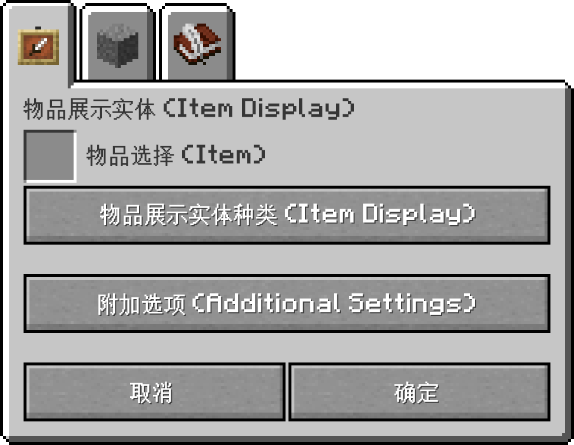

> 感谢闽高联 AB 帮助我将这篇教程转移至Github Repository
> 本教程作者 某个草 ，原文位置 https://hi-ysumc.feishu.cn/wiki/QDJBwtCBEi5eLakfWCvcRtErnvb?from=from_copylink 请勿二次转载。

# 展示实体编辑功能

# 引言

1.19.4 后，Minecraft 加入了“展示实体”（Display）以灵活展示多种内容。但此类展示实体只能通过 `//summon` 指令生成，这需要建筑师有一定的指令基础知识才能玩转展示实体。

**Axiom 提供了一整套基于图形化 UI 的展示实体创建编辑方案，从而让建筑师更优雅从容地创建并编辑展示实体。**笔者认为这种图形化的方案相当具有革命性，是 Axiom 最大的闪光点。

该建筑由 Claze_MC 使用 Axiom“展示实体编辑功能”制作。
[点此前往](https://www.planetminecraft.com/project/botanical-bliss/)

当玩家物品栏的选择光标不在“功能”栏位上时，按住 `LAlt` 键，可以呼出 Axiom 的创造模式附加菜单，点击“Create Display Entity”（创建展示实体），进入展示实体创建菜单。

# 展示实体创建菜单（Create Display Entity）

## 物品展示实体（Item Display）

物品展示实体创建菜单选项如下：

### 物品选择（Item）

点击选择 Minecraft 物品栏的一个物品。

选择界面有一个“仅显示具有 **CustomModelData** 的物品”的筛选项，勾选后则仅显示具有**‘CustomModelData’**NBT 标签的物品。

> [!TIP]
> **‘CustomModelData’是一种 NBT 标签，用于覆盖物品模型**。
> ——Minecraft Wiki 《物品格式》

### 物品展示实体种类（Item Display）

选择物品展示实体的实体模型来源。

目前物品展示实体种类有以下可选项：

1. **NONE：**一般的物品实体。
2. **HEAD:**玩家头戴某个物品时显示的实体。
3. **GUI：**GUI 或物品栏上显示的实体（没错，GUI 上的不是图片，是渲染的实体）。
4. **GROUND:**物品或方块掉落时形成的实体。
5. **FIXED:**物品展示框内部的实体【需要验证】。
6. **THIRDPERSON_LEFTHAND：**第三人称视角中玩家副手所持的物品实体。
7. **THIRDPERSON_RIGHTHAND：**第三人称视角中玩家主手所持的物品实体。
8. **FIRSTPERSON_LEFTHAND：**第一人称视角中玩家副手所持的物品实体。
9. **FIRSTPERSON_RIGHTHAND：**第一人称视角中玩家主手所持的物品实体。

> [!TIP]
> 更改此选项可能会更改实体的控制点，初始姿态和渲染方式。
> 例：同样是末地烛实体，种类为“NONE”的末地烛实体和种类为“HEAD”的末地烛实体的控制点和最初摆放方式是不一样的。~~这也是为什么将末地烛戴在头上看起来像是独角兽而不是天线宝宝。~~

### 附加选项（Additional Settings）

附加选项用于确定展示实体的附加选项。其中的数值决定了实体的描述字段。

> [!TIP]
> 翻译和解释从 Minecraft Wiki 词条：[23w06a](https://zh.minecraft.wiki/w/23w06a) 二次阐释而来。若有错误，恳请斧正。

- **剔除边界框宽度（Culling Width）**

描述剔除边界框的宽度，数值为 0 则禁用剔除选项。

- **剔除边界框高度（Culling Width）**

描述剔除边界框的高度，数值为 0 则禁用剔除选项。

- **变换时间插值（Interpolation Ticks）与传送时间插值（Teleport Ticks）**

单位为游戏刻（Tick）

展示实体具有位置，角度和任意仿射变换值，展示实体可以记录“当前值”和“先前值”，其中变换的时间即为变换时间插值和传送时间插值。启用插值时，实体会随时间在“先前值”和“当前值”之间变化。数值为 0 时，则为突变。设为-1 时，则加载当前游戏时间。

- **（覆盖）发光颜色（Glow Color Override）**

使用 16 位颜色 + 透明度插值，默认为 0xffffffff（100% 不透明度纯白色）。

> [!TIP]
> 16 位颜色 + 透明度代码构成：
> **fffff+ff****（Hex 六位色号 + 两位透明度）**

- **渲染时瞄准玩家方式（Billboard）**

用于控制这些实体渲染时是否应该旋转面对玩家。

目前有以下可选项：

1. **FIXED：无旋转。**
2. **VERTICAL：实体可绕竖直轴旋转。**
3. **HORIZONTAL：实体可绕水平轴旋转。**
4. **CENTER：实体可以绕几何中心点旋转。**

- **覆写亮度值（Override Brightness）**

默认为关（即使用实体所在地的光照）。若打开，则覆盖渲染所用的亮度值。

该选项打开后，显示以下两个调节条：

**天空光照值（Sky Brightness）：天空光照的值，范围是 0~15。**

**方块光照值（Sky Brightness）：方块光照的值，范围是 0~15。**

- **阴影半径（Shadow Radius）**

调节实体阴影的大小，数值为 0 则无阴影。

- **阴影强度（Shadow Strength）**

实体阴影的强度。作为随与下方方块的距离而变化的函数，控制阴影的不透明度。默认为 1，调节范围是 0~2。

- **最大可视范围（View Range）**

此实体的最大可视范围，实际距离也取决于客户端的渲染距离和实体渲染距离。默认值为 1（与火球大致相同），调节范围是 0~2。

## 方块展示实体（Block Display）

### 方块选择（Block）

点击选择 Minecraft 物品栏的一个方块。

选择完毕方块后，会跳转到方块属性菜单，玩家可以在菜单里改变方块属性。

> [!TIP]
> 这个功能也能当个方块属性查看器。

### 附加选项（Additional Settings）

与“**展示实体创建菜单**”一章内的“**附加选项**”功能一致，不再赘述。

## 文字展示实体（Text Display）

您可以在文字栏写入您想要输出的文字，其支持 Minecraft 的全部颜色语法。

> [!TIP]
> 当你在文字栏换行并保存后，再次打开时换行处会变成换行前缀“\n”，请留意。
> 例：在文字栏输入：
> 人人为我
> 我为人人
> 保存后再次打开，文字栏显示为：
> 人人为我\n 我为人人

### 附加选项（Additional Settings）

与“**展示实体创建菜单**”一章内的“**附加选项**”功能一致，不再赘述。

### 背景颜色（Background Color）

- **默认背景（Default Background）**

打开时使用默认背景，关闭时需要手动输入 16 位颜色 + 透明度插值，默认为 0x40000000。

- **行宽（Line Width）**

用于控制换行的行宽，默认为 200（不是 200 字）。

- **对齐方式（Allignment）**

用于调节文字对齐方式，即左对齐、居中、右对齐。

- **穿透方块显示（See Through）**

用于调节文本是否可以穿透方块（或实体）显示，打开则可以穿透。

- **文本阴影（Shadow）**

用于调节文本阴影。

- **文本不透明度（Text Opacity）**

用于调节文本不透明度，调节范围是-1~255，数字越大不透明度越大（-1 等效 255）。

# 展示实体编辑

在 Axiom 中，您可以直接对生成的展示实体进行直接编辑，从而免去不断重新生成展示实体的麻烦。

展示实体中会有一个白色半透明的立方体作为控制点，左键此点可呼出展示实体操作轴，右键此点可呼出有关该实体的其他设置。

> [!TIP]
> **注意：您需要将附加菜单的“其他设置”中的“显示展示实体操作轴”（Show Display Enitity Gizmo）设为“开”，才会显示选择点。**

## 展示实体操作轴

> [!TIP]
> **注意：截至 Axiom4.4.0，该工具可能有恶性 Bug，请留意或尽早汇报至官方。**
> **目前表现为：**

- **展示实体控制点只能在破坏方块后出现，且展示实体操作轴会随着控制点的消失而消失，但仍旧可以操作。**

默认情况下，展示实体操作轴调节均为“全局”（GLOBAL）,即按照世界的 X,Y,Z 轴进行方向区分。

左键按住对应的控制手柄拖拽以调节展示实体的移动，旋转与缩放，左键按住控制点拖拽以自由移动展示实体。

可以使用鼠标滚轮对展示实体进行移动，调节方向以玩家面朝的轴线方向为准（X,Y,Z）。

变换时，物品栏上方会有数据提示展示实体的目前的情况。

使用 **Ctrl****+****C**** ****Ctrl****+****V** 复制粘贴选择的展示实体。

使用 **delete** 键删除该展示实体。

右键点击某区域可直接将展示实体移动到右键处。

离开展示实体过远或左键操作轴外区域会取消选择。

> [!TIP]
> 附加菜单的“其他设置”中的“显示操作轴键位提示”（Show Key Hints）设为“开”时，游戏画面左下角会显示操作提示。

变换展示实体的单位元在不同模式下是不一样的。

- **一般情况：**
  移动单位元：0.0625 方块
  旋转单位元：1°
  缩放单位元：0.0625 方块
  （小数点后保留三位，四舍五入）
- **按住****shift****时**:
  移动单位元：不受限制
  旋转单位元：不受限制
  缩放单位元：不受限制
- **按住****ctrl****时**:
  移动单位元：1 方块
  旋转单位元：15°
  缩放单位元：三轴缩放 0.0625 方块
  （小数点后保留三位，四舍五入）

## 展示实体编辑设置

右键展示实体操作轴，可以显示展示实体编辑设置。

- **编辑种类（Edit Properites）**

打开展示实体创建菜单（Create Display Entity）

- **编辑变换（Edit Transformation）**

打开展示实体变换菜单，查看并编辑位置，旋转和缩放设置。

- **操作轴模式(Gizmo Mode)**

**全局（GLOBAL）：**以世界 X,Y,Z 轴作为操作轴方向。

**本地（LOCAL）：**以展示实体法向作为操作轴方向。

- **移印（Duplicate）**

在保留原先展示实体的基础上，复制该展示实体

- **编组（Grouping）**

对附近给定半径内的展示实体编成一组展示实体，编组共享一个操作轴和生成指令。

编组后的控制点和操作轴以选择被进行编组的展示实体为准。

- **复制生成指令（Copy Summon Command）**

复制该展示实体的生成指令。若展示实体被编组，则生成整个编组的生成指令。

生成指令不会记录展示实体的绝对坐标。生成后的展示实体的控制点默认为一个方块区域的几何中心。
