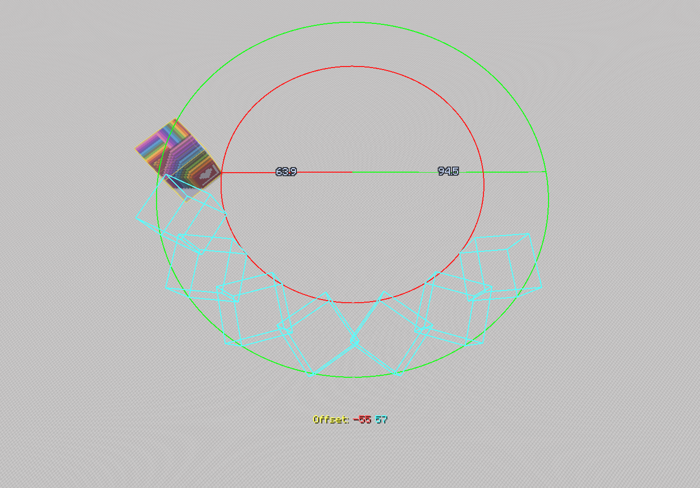
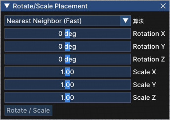

# 编辑器功能（Editor Mode）

# 引言

Axiom 内置一个嵌入游戏的强大的图形化界面可视化编辑器，可以让玩家使用类似于专业软件的操作来进行建筑工作。其工作方式和工作逻辑类似于 MCEdit。

**按下****RShift****进入可视化编辑器，再次按下退出可视化编辑器。**

编辑器使用了 imGUI，类似于其他的专业软件，将鼠标放在边栏上可以左键拖动，面板可以单独开关或重新布局。

您可以在“菜单栏 > 窗口”中找到所有的面板。

# 基础操作

> [!TIP]
> 本章节介绍的是 Axiom 默认的键位，之后全部操作都会在默认键位下进行介绍。
> **真正的操作键位请以编辑器下方的“操作提示”显示的内容为准。**
> 键位可以在**菜单栏 > 帮助 > 键位设置**中更改。
> **Axiom 还有一整套类似 Blender 的键位预设，很具有人文关怀的行为。**

在没有启动任何工具的情况下，Axiom 的默认键位如下：

<table>
<tr>
<td colspan="3">基础<br/></td></tr>
<tr>
<td>**键位**<br/></td><td>**界面原文**<br/></td><td>**备注**<br/></td></tr>
<tr>
<td>左键<br/></td><td>旋转视角模式<br/></td><td>按住拖动可以摄像机为旋转中心观察四周。<br/></td></tr>
<tr>
<td>`Ctrl`+左键<br/></td><td>环绕视角模式<br/></td><td>按住拖动可以以鼠标指针所指的方块为中心进行环绕观察。<br/></td></tr>
<tr>
<td>鼠标中键<br/></td><td>获得目标方块<br/></td><td>与游戏内鼠标中键功能一致。<br/></td></tr>
<tr>
<td>鼠标滚轮<br/></td><td>-<br/></td><td>以摄像机方向缩放距离。<br/></td></tr>
<tr>
<td>右键<br/></td><td>准心<br/></td><td>显示准心（不启动工具下没有其他作用），按住拖动可以观看四周。<br/></td></tr>
<tr>
<td>`Ctrl`+右键<br/></td><td>平移相机模式<br/></td><td>按住拖动可以让摄像机平移。<br/></td></tr>
</table>

<table>
<tr>
<td colspan="3">通用编辑<br/></td></tr>
<tr>
<td>**键位**<br/></td><td>**界面原文**<br/></td><td>**备注**<br/></td></tr>
<tr>
<td>`Ctrl`+`Z`<br/></td><td>撤销<br/></td><td>-<br/></td></tr>
<tr>
<td>`Ctrl`+`Y`<br/></td><td>重做<br/></td><td>-<br/></td></tr>
<tr>
<td>`Ctrl`+`X`<br/></td><td>剪切<br/></td><td>剪切的选区内结构不会在剪贴板内显示。<br/></td></tr>
<tr>
<td>`Ctrl`+`C`<br/></td><td>复制<br/></td><td>复制选区内结构到剪贴板。<br/></td></tr>
<tr>
<td>`Ctrl`+`V`<br/></td><td>粘贴<br/></td><td>粘贴剪切板内容。<br/></td></tr>
<tr>
<td>`Ctrl`+`P`<br/></td><td>保存蓝图<br/></td><td>将选区内结构保存为.bp文件。<br/></td></tr>
<tr>
<td>`Enter`<br/></td><td>清除选择<br/></td><td>在框选模式下，按 Enter 确定选择，再次按 Enter 清除选择。<br/></td></tr>
<tr>
<td>`Delete`<br/></td><td>-<br/></td><td>删除选区内结构。<br/></td></tr>
</table>

> [!TIP]
> 鼠标放在滑动条上，按住 `LCtrl`,可以定量输入数字。**允许超出滑块限制值，但有崩溃风险。**

# “选择的方块”面板与“调色盘”面板

## 选择的方块面板

“选择的方块面板”会记录下进行需要放置方块操作时优先选择的方块（当工具有选择方块选项时除外）。
左键单击方块图标可以呼出物品栏，以更换优先选择的方块，使用中键也可以更换优先选择的方块。
如果方块有属性，则会在预览图标下显示，玩家可以视情况调节。

## 调色盘面板

“调色盘”面板会记录下玩家最近使用的方块，玩家也可以在“自定义”选项中右键添加其常用的方块。

## 方块卡片

“选择的方块”和“调色盘”面板均由“方块卡片”构成，方块卡片可以通过拖拽以进行直接选取。


# 历史记录面板

历史记录面板会记载玩家操作的历史记录和其所占的硬盘空间。
您可以手动清空历史记录，但请谨慎行事。


# 世界选项面板

世界选项面板可以调节该世界存档的部分游戏规则。

> [!TIP]
> Axiom 世界选项的“玩家无敌”选项可以使玩家**彻底没有被杀死的办法**（包括虚空伤害和/kill）。
> 部分服务器中，“游戏规则”和“方块”会被隐藏，除非获得总管理员权限。


# 速度滑块

调节飞行速度，飞行速度与游戏内飞行速度同步。

> [!TIP]
> 速度一般限制在 1~9.99。但可以手动输入数据，从而达到更高的飞行速度。

# 工具面板

Axiom 的工具面板有一系列工具可以使用**。**

**蒙版工具**可以在逻辑上操作工具面板的工作逻辑（详情见本文：**蒙版工具选项**）。

## 选区类工具

选区类工具可以提供一个选区供玩家编辑或进行其他操作。

> [!TIP]
> **注意：截至 Axiom4.4.0，部分选区类工具有恶性 Bug，请留意或尽早汇报至官方。**
> **目前表现为：**

- **框选工具只能在“添加”模式下连续选择三次才能出现选框 GUI（仅为不显示 GUI，选区仍旧存在）。**
- **套索选取不显示绘制痕迹。**

> [!TIP]
> 类似于 Ps 的逻辑，在有选区的情况下只能编辑选区内的结构。所以当您发现您不能编辑某处时，请查看您的选区是否未被删除。

**选区类工具有以下通用选项：**

- **模式：**在进行多次选区操作时产生的最终结果。

<table>
<tr>
<td>替换<br/></td><td>再次选择时，删除原有选区并创建一个新选区。<br/></td></tr>
<tr>
<td>添加（默认）<br/></td><td>再次选择时，选区范围会增加，最终选区是所有操作的并集。<br/></td></tr>
<tr>
<td>差集<br/></td><td>再次选择时，选区范围会减少，最终选区是最初选区的差集。<br/></td></tr>
<tr>
<td>交叉<br/></td><td>再次选择时，选区范围会减少，最终选区是所有操作的交集。<br/></td></tr>
</table>

当选区被确定后，会出现“选区选项”窗口，可以通过该窗口进行进一步操作。


**选区遵循以下操作：**

<table>
<tr>
<td colspan="3">选区操作<br/></td></tr>
<tr>
<td>**键位**<br/></td><td>**界面原文**<br/></td><td>**备注**<br/></td></tr>
<tr>
<td>`Enter`<br/></td><td>确认<br/></td><td>没有选区的话，则确定选区。<br/></td></tr>
<tr>
<td>`Enter`<br/></td><td>清除选择<br/></td><td>已有选区的话，则清除选择。<br/></td></tr>
<tr>
<td>`Ctrl`+`F`<br/></td><td>填充<br/></td><td>用某种方块填充。<br/></td></tr>
<tr>
<td>`Ctrl`+`Y`<br/></td><td>替换<br/></td><td>用某种方块替换。<br/></td></tr>
<tr>
<td>`Ctrl`+`C`<br/></td><td>复制<br/></td><td>复制选区内结构到剪贴板，粘贴后退出粘贴界面。<br/></td></tr>
<tr>
<td>`Ctrl`+`X`<br/></td><td>剪切<br/></td><td>剪切的选区内结构不会在剪贴板内显示。<br/></td></tr>
<tr>
<td>`Ctrl`+`J`<br/></td><td>移印（Duplicate）<br/></td><td>粘贴选区内结构，但不退出粘贴界面，可以多次进行操作。<br/></td></tr>
<tr>
<td>-<br/></td><td>创建标记区域<br/></td><td>在游戏内创建一个标记区域，只能在游戏内移除。<br/></td></tr>
</table>

> [!TIP]
> 有关于选区可以做的其他事情，请参看“操作选项菜单”一章。

### 魔法选择工具

魔法选择工具会选择给定最大数量且相邻的同种（或同属性）方块，其选区半径遵从**曼哈顿距离**，选区团簇会尽可能地保持最小的表面积。

右键确定选择，使用 `Enter` 清除选区。

> [!TIP]
> 曼哈顿距离详情见 Minecraft Wiki 词条：[距离](https://zh.minecraft.wiki/w/%E8%B7%9D%E7%A6%BB)

- **比较****【原文如此】：**选择可纳入选区的方块的种类。

<table>
<tr>
<td>方块<br/></td><td>选择同种方块。<br/></td></tr>
<tr>
<td>方块状态<br/></td><td>选择同种且具有相同属性的方块。<br/></td></tr>
<tr>
<td>固体<br/></td><td>选择整方块（台阶，楼梯等均均不可被选择）。<br/></td></tr>
<tr>
<td>任意<br/></td><td>选择所有可被选择的方块。<br/></td></tr>
</table>

- **方块数量限制：**选择可纳入选区的方块最大数量，范围是 1~1000000。
- **范围：**在选区外扩展一定的距离，在该距离范围内的同种（或同属性）方块会被纳入选区，范围是 1~5。

> [!TIP]
> 当范围选择为 1 时，会出现“仅表面”可选项，勾选后将仅选择选区内团簇表面的一方块厚的外壳。
> 勾选后，**新选区半径遵循切比雪夫距离**，选区团簇会尽可能地保持最小的表面积。


### 框选工具

经典的立方体框选工具。

右键确定第一个点，再次右键确定第二个点，最终发选区将会是一个以第一点和第二点的连线作为体对角线的立方体。

框选区内有三个点，分别表示第一点、第二点和选区几何中心，左键以上三点可以呼出操作轴，拖动操作轴可以改变选区大小（选择第一，第二点）或改变选区位置（选择选区几何中心）。

**可以使用鼠标滚轮进行移动，调节方向以玩家面朝的轴线方向为准（X,Y,Z）。**

**框选工具的选区需要再次确认才可选择：**<u>若选区外框为白色，说明该选区仍为预览状态，此时无法进行选区操作。使用</u>**Enter**<u>确定选择，此时选区外框变为黄色，证明选区已确认。</u>

再次使用 `Enter` 清除选区。


- **输入数据（Input）：**显示或编辑框选工具的位置数据和大小。

<table>
<tr>
<td>位置与尺寸（Position&Size）<br/></td><td>显示并编辑选区的**几何中心坐标**和**选区大小**。<br/></td></tr>
<tr>
<td>第一点与第二点（Pos1&Pos2）<br/></td><td>显示并编辑选区的**第一点**与**第二点**。<br/></td></tr>
</table>

- **收缩：**收缩选区以保证选区外围没有空气层。

#### 标记区域

立方体框选工具也可以建立一个标记区域，用以辅助参考。

标记区域由标签（默认为“Unnamed Marker”）和一个连带的区域范围构成。**即使退出编辑器模式，标记区域也在游戏内可见。**

当玩家距离标记区域边缘超过 10 方块，标记区域会自动消失，靠近后又重新显示。

> [!TIP]
> 因为该特性，玩家在规模过大的标记区域中可能会出现丢失目标的情况，请留意。


在游戏内左键选择标记区域内标签下的半透明白色方块，可呼出操作轴，鼠标操作，可以改变标签的位置。

呼出操作轴后，无论距离，标记区域将一直可见。

呼出操作轴后，按 `delete` 可删除标记区域。


在游戏内右键选择标记区域标签下的半透明白色方块，可进入编辑界面。

- **名称（Name）：**编辑标记区域的名称。若为空，则显示为“Unnamed Marker”
- **区域（Box）：**确定标记区域对角的两点位置（XYZ 坐标）
- **确定俯仰/偏航角：**作用尚不明确。
- **代码块：**采用代码记录以上数据，可能用于共享标记区域数据。


### 自由选取工具

使用笔刷对选区进行自由选取。

右键绘制选区范围。

- **形状刷子：**编辑笔刷形状与尺寸数据，详细内容请参看“笔刷工具”一章。

### 套索选取

使用套索对选区进行选取.

右键绘制套索，屏幕空间内显示的被套索围合的全部方块均会被选择。

- **深度：**确定套索选区深度，深度方向以玩家面朝方向向量为准。范围是-64~64。

> [!TIP]
> 插值为 0 时，套索将无法正常选择。

- **包括非固体方块：**插值非 0 时可选，勾选后可选择区域里包含非固体方块。

## 注记类工具

注记类工具可以让您在工作中做标注，该标注在离开编辑器模式后仍会可见。

### 标尺工具

- **线条标尺（Line）**

右键目标方块以创建标记点，当标记点超过两个时，相邻的两个标记点会出现距离标记。

距离标记的端点是方块的几何中心。

- **显示：**更改距离标记显示数据类型，可显示方块数量或距离（精确到小数点后一位）。
- **信息：**显示全部标尺的信息。
- **所有标记点：**可以显示并编辑所有标记点的坐标，也可以创建一个新的标记点。


- **圆标尺（Circle）**

右键目标方块以确定圆心，右键其他方块以确定经过圆弧的点。操作结束后，会出现一个以方块构成的圆。

多次操作下，可以创建多个圆标尺。

- **显示：**更改距离标记显示数据类型，可显示方块数量或距离（精确到小数点后一位）。


### 注记工具（Annotation）

右键在世界中绘制，该纹理在离开编辑器模式后仍在世界中可见。

- **笔记注记（Draw）**

右键绘制，可调节笔迹的粗细和颜色，笔迹会以以平面空间为投射点，平行投射到结构面上。


> [!TIP]
> 笔迹的粗细渲染是基于屏幕空间决定的，不遵循透视法则。
> 也就是说距离笔迹越远，笔迹的粗细会在视觉上更粗。

> [!TIP]
> 笔记注记的绘制有轻微的抖笔修正，很具有人文关怀的行为。

- **轮廓注记（Outline）**

右键绘制，结果是方块轮廓。可调节轮廓的颜色，笔迹会以以平面空间为投射点，平行投射到结构面上。

- **手绘（Freehand）：**使用手绘的方式绘制。
- **线条（Line）：**右键点击以绘制连续的线段，点击“结束线条（Finish Line）”结束绘制。
- **区域（Box）：**右键点击确定两个角点以绘制一个立方体区域的注记。


- **文字注记（Text）**

在文字框中输入文字，右键点击放置文字注记。

您可以调节字的轮廓和大小与阴影。

文字注记的放置角取决于玩家的视角，若玩家在墙上设置文字注记，则文字注记一定是水平的。


> [!TIP]
> Axiom 提供了一些特殊符号，您可以点击按钮输入这些特殊字符，但只能在文字注记开头输入一个。

- **图片注记（Image）**

右键放置图片注记，目前不能选择本地文件，只能通过 URL 来放置图片。

您可以调节图片注记的大小和透明度。

图片注记的放置角取决于玩家的视角，若玩家在墙上设置图片注记，则图片注记一定是水平的。

若图片注记的索引 URL 丢失或错误，图片注记会显示为“丢失材质”。

> [!TIP]
> 如果您常使用论坛，大抵会知道“图床”这类网站。
> 图床用于托管图片，您上传图片到一个服务器，然后可以获取该图片的 URL，部分论坛会要求您提供图片的 URL，提供您上传的图片的 URL 后，网站便可以索引到该图片并显示。
> **部分图床网站可能会突然停止运营，请注意。**


- **擦除（Erase）**

右键框选，进入框选范围的注记均会被删除。

您也可以在此删除全部的注记。

- **移动（Move）**

此时注记会显示控制点，点选控制点可呼出操作轴，您也可以改变注记的属性。


## 笔刷类工具

玩家可以使用笔刷工具绘制或改变结构。

> [!TIP]
> 如果您有选区，则笔刷只能在选区空间内进行使用。

**笔刷类工具有以下通用选项：**

- **形状刷子：**编辑笔刷形状与尺寸数据。

<table>
<tr>
<td colspan="2">形状刷子预设<br/></td></tr>
<tr>
<td>**预设**<br/></td><td>可调数据<br/></td></tr>
<tr>
<td>球体<br/></td><td>半径<br/></td></tr>
<tr>
<td>立方体<br/></td><td>（切比雪夫距离）半径<br/></td></tr>
<tr>
<td>正八面体<br/></td><td>（曼哈顿距离）半径<br/></td></tr>
<tr>
<td>圆柱形<br/></td><td>半径，高度（Height）<br/></td></tr>
<tr>
<td>椭球<br/></td><td>半径，高度（Height）<br/></td></tr>
<tr>
<td>长方体<br/></td><td>（切比雪夫距离）半径，高度（Height）<br/></td></tr>
<tr>
<td>胶囊形<br/></td><td>半径，高度（Height）<br/></td></tr>
<tr>
<td>双锥形<br/></td><td>半径，高度（Height）<br/></td></tr>
</table>

### 绘制工具

右键拖动在结构表面绘制。

- **仅蒙版表面：**勾选后，操作只会修改方块团簇表面的一方块厚的外壳。
- **绘制模式（Mode）：**调节绘制模式。

<table>
<tr>
<td>操作方块【原文如此】<br/></td><td>以“选择的方块”选项卡中的方块绘制。<br/></td></tr>
<tr>
<td>剪贴板<br/></td><td>绘制剪贴板内的内容（仅限结构的顶层平面）。<br/></td></tr>
<tr>
<td>梯度排布（Gradient）<br/></td><td>绘制具有分布梯度的图案。排布方块数目种类和分配梯度均可编辑。<br/></td></tr>
</table>

**梯度排布（Gradient）模式选项：**

- **函数插值法：**确定梯度插值。

<table>
<tr>
<td>最近的【原文如此】<br/></td><td>不同方块之间以硬边缘连接（可调节分配梯度）。<br/></td></tr>
<tr>
<td>线性<br/></td><td>不同方块之间以线性过渡。<br/></td></tr>
<tr>
<td>贝塞尔<br/></td><td>不同方块之间以贝塞尔线性插值，贝塞尔内半径可调。<br/></td></tr>
</table>

- **种子：**确定插值用的方式，可以自己输入或随机选择。


- **融合笔触：**开启后，**只要不关闭绘制工具或更改其他选项，所有的笔触均会共享梯度。**


- **柔和边缘：**仅限线性插值和贝塞尔插值。开启后，笔刷外会变为柔和边缘，其插值以“函数插值法”模式为准。
- **方块：**仅限“最近的”插值。可添加，移除或编辑笔触使用的方块和出现概率，列表越往下的则排布越靠外。
- **预设（Preset）：**保存或使用您设置好的配置。

### 噪声绘制工具

右键拖动，使用给定的噪声图进行绘制。


- **3D 模式：**若关闭，则仅在 X,Z 轴平面上绘制噪声。


- **仅蒙版表面（Surface）：**勾选后，仅在方块团簇的表面进行绘制。
- **各向异性：**勾选后，可以在多个轴方向上调节缩放大小。
- **噪声类型选项：**

<table>
<tr>
<td>噪声类型<br/></td><td>介绍<br/></td><td>图片（有四种方块的布局）<br/></td></tr>
<tr>
<td>保持不变【原文如此】<br/></td><td>应该是一种柏林噪声。<br/></td><td><br/></td></tr>
<tr>
<td>泰森多边形边缘<br/></td><td>类似于碎石路的噪声。<br/></td><td><br/></td></tr>
<tr>
<td>细胞噪声（Worley）<br/></td><td>类似于鹅卵石路的噪声。<br/></td><td><br/></td></tr>
<tr>
<td>融球效果<br/></td><td>类似于水渍排布的噪声。<br/></td><td><br/></td></tr>
<tr>
<td>白噪<br/></td><td>纯随机分布。<br/></td><td><br/></td></tr>
<tr>
<td>泼溅噪声（Splatter）<br/></td><td>一种随机泼溅感的噪声。<br/></td><td><br/><br/></td></tr>
</table>


- **抖动：**调节噪声纹理的不稳定程度。
- **频率叠加层数：**调节噪声纹理的破碎程度。

（其他调节项均为专属）

- **方块：**可添加，移除或编辑笔触使用的方块和出现概率，列表越往下的在噪声预览中显示的颜色越深。
- **种子：**确定插值用的方式，可以自己输入或随机选择。
- **预设（Preset）：**保存或使用您设置好的配置。

### 生物群系绘制工具

右键拖动绘制生物群系。


**生物群系绘制工具选项：**

- **生物群系选择：**选择您希望绘制的生物群系。
- **垂直填充：**勾选后，世界 Y 轴高度上的生物群系将全部改变。
- **生物群系可视化：**勾选后可以看见生物群系的边界框。

### 渐变绘制工具

右键第一点，再右键第二点以绘制渐变，渐变设置结果将在第二点上的笔刷生成。

- **形状**：设置渐变形状。目前有平面渐变和球体（径向）渐变。
- **函数插值法：**确定梯度插值。插值法列表请参看“绘制工具”。
- **Locking：**作用不详。
- **夹紧到边缘****【原文如此】：**仅绘制渐变处。
- **种子：**确定插值用的方式，可以自己输入或随机选择。
- **方块：**添加，移除或编辑笔触使用的方块和出现概率，列表越往下的则排布越靠外。
- **预设（Preset）：**保存或使用您设置好的配置。

### 自由绘制工具

右键拖拽以在三维空间中绘制几何体，方块材质使用“选择的方块”选项卡里的材质。

### 擦除工具

右键拖动可对结构产生侵蚀，其侵蚀逻辑和介质为空气的笔刷有所区别。

- **强度：**范围 0.75~10，数值越高笔刷选区越近似于球体。
- **平滑临界值：**范围 0.01~1.00，数值越低连接越平滑。
- **预设（Preset）：**保存或使用您设置好的配置。

### 雕绘工具

右键拖拽以在方块表面进行雕绘，其笔刷使用的方块按照绘制时表面的方块材质决定。


- **强度：**确定雕绘的强度
- **反转：**勾选后从操作从“添加”变成“减去”。
- **遮挡 Y 轴****【原文如此】：**勾选后，该笔刷不能在 X 轴方向和 Z 轴方向上生效。
- **降噪工具：**勾选后，笔刷将更柔和。
- **预设（Preset）：**保存或使用您设置好的配置。

### 脚本笔刷工具

右键拖动，使用玩家编写的脚本或模组的预设进行笔刷绘制，使用 Lua 语言。

> [!TIP]
> 该工具需要一定的编程知识才可以玩转，可惜笔者并不是一个相当了解编程的人，所以笔者无法再深入探讨其操作。

**脚本笔刷工具预设例：**

- **平原地形（Terrain:Plains）**

```lua
-- Ignore non-solid blocks
if not isSolid(getBlockState(x, y, z)) then
        return nil
end

-- Load custom arguments
local top = $blockState(Top, grass_block)$
local mid = $blockState(Middle, dirt)$
local below = $blockState(Bottom, stone)$

-- Calculate depth
local depth = 0
for i=0,6 do
   if i == 6 then
          return below
   end
   if not isSolid(getBlockState(x, y+i+1, z)) then
           depth = i
           break
   end
end

-- Grass on top
if depth == 0 then
        return top
end

-- Dirt underneath
local noise = getSimplexNoise(x/32, y/32, z/32)
local dirt_depth
if noise < 0.1 then
        dirt_depth = 2
elseif noise < 0.5 then
        dirt_depth = 3
elseif noise < 0.9 then
        dirt_depth = 4
else
        dirt_depth = 5
end

if depth < dirt_depth then
return mid
else
        return below
end
```

### 岩石工具

右键拖动绘制有部分噪声侵蚀的几何体，其结果形似岩石。

- **噪声生成半径：**范围 5~30，数值越大几何体越平滑。
- **噪声生成强度：**范围 0~1，数值越大侵蚀越严重。
- **噪声场随机种子：**确定噪声生成的方式，可以输入给定的数或留空（默认随机选择）。
- **平滑离散程度：**范围 0~5，数值越低表面越粗糙（甚至破碎）。
- **融合强度：**范围 0~3，数值越高与地面融合程度越高。

### 焊接工具

右键拖动可强行平滑连接两个团簇，其构型形似焊缝。


- **强度：**范围 0.75~10，数值越高笔刷选区越近似于球体。
- **平滑临界值：**范围 0.01~1.00，数值越低连接越平滑。
- **预设（Preset）：**保存或使用您设置好的配置。

### 仿制图章

仿制图章使用蓝图和剪贴板进行工作，导入一个或多个蓝图或剪贴板内容后，右键拖动可以进行散布。


- **基础概率：**绘制时蓝图文件与绘制选区的总体分布概率，范围是 0.001~1，**调节块并不是线性的**。
- **最小留空（Min Spacing）:**确定散布的蓝图的几何中心的最小留空空间，范围是 0~64。
- **放置方式（Place）：**可选延迟放置还是立刻放置。
- **随机旋转（Random Yaw）：**勾选后散布的蓝图会随机旋转。
- **随机 X/Z 反转（Random X/Z Flip）：**勾选后散布的蓝图会随机进行 X/Z 轴翻转。
- **保留已有内容：**勾选后，预览选区内与原有结构相重合的地带不会被粘贴。
- **将底部延伸到地面：**将底层方块向下复制，直到碰到一个实心方块。
- **添加蓝图：**添加，移除或编辑笔触使用的蓝图和出现概率。
- **添加剪贴板（Add Clipboard）：**添加剪贴板内的内容和出现概率。
- **预设（Preset）：**保存或使用您设置好的配置。

### 相对高度工具【原文如此】

右键拖动可从 Y 轴方向上进行地形塑造，其逻辑类似具有地形编辑器的游戏或工具，相对高度工具使用圆柱体笔刷**。**

- **Y 轴限制（Y Limit）：**限制笔刷可以塑造地形的最大高度，范围是 0~64。
- **模式（Mode）：**笔刷操作模式。

<table>
<tr>
<td>抬升（Raise）<br/></td><td>抬升地形。<br/></td></tr>
<tr>
<td>降低（Lower）<br/></td><td>降低地形。<br/></td></tr>
<tr>
<td>扁平化<br/></td><td>在鼠标指向的方块的海拔高度上抬升或降低地形，使其高度与目标方块一致。<br/></td></tr>
<tr>
<td>向上扁平化<br/></td><td>在鼠标指向的方块的海拔高度上**仅抬升地形**，使其高度与目标方块一致。<br/></td></tr>
<tr>
<td>向下扁平化<br/></td><td>在鼠标指向的方块的海拔高度上**仅降低地形**，使其高度与目标方块一致。<br/></td></tr>
</table>

- **平滑程度（Smoothing）**：更改笔刷平滑度。
- **应用【原文如此】****：**选择长按右键时是否进行连续操作。
- **速率（Rate）：**操作速率，范围是 0~32，插值越大速率越快。
- **衰减向上扁平化【原文如此】****：**由一系列旋转体截面图构成，可以确定塑造地形时每一点的强度和提拉程度。
- **自定义高度图：**自定义导入一个 256*256 灰度图 png。

> [!TIP]
> 将模组 JAR 文件解包后，找到“default_heightmaps”文件夹，内部有一系列 Axiom 的预设高度图。


- **预设（Preset）：**保存或使用您设置好的配置。

### 斜坡工具

创建一个给定斜率和旋转角度的斜坡。

1. 右键点选一点确定直角边一点，移动鼠标到另一个点以确定直角三角形的角度，直角边长度和 Y 轴旋转角。


1. 按住右键进行绘制，此时游戏画面会形成一个斜面（或圆锥面），绘制的斜坡的斜面以此面为基准。

松开右键，即取消绘制。


- **Y 轴限制（Y Limit）：**限制笔刷可以塑造地形的最大高度，范围是 0~64。
- **模式（Mode）：**笔刷操作模式。

<table>
<tr>
<td>升高<br/></td><td>塑造斜面时仅抬升地形。<br/></td></tr>
<tr>
<td>降低<br/></td><td>塑造斜面时仅降低地形。<br/></td></tr>
<tr>
<td>升高或降低（Raise&Lower）<br/></td><td>塑造斜面时既抬升地形又降低地形。<br/></td></tr>
</table>

- **平滑程度（Smoothing）**：更改笔刷平滑度。
- **斜面形状（Shape）：**确定直角三角形产生的斜面的种类，可选平面和圆锥面。
- **衰减向上扁平化【原文如此】****：**由一系列旋转体截面图构成，可以确定塑造地形时每一点的强度和提拉程度。
- **预设（Preset）：**保存或使用您设置好的配置。

### 平滑工具

右键拖拽结构以使其平滑。

- **强度：**改变平滑强度程度，范围是 0~10。
- **方块比例：**改变平滑侵蚀程度，范围是 0%~200%。
- **平滑方式：**

<table>
<tr>
<td>融化的<br/></td><td>以损失方块数量为代价平滑。<br/></td></tr>
<tr>
<td>保持的<br/></td><td>平滑的同时保持方块数量。<br/></td></tr>
<tr>
<td>生长<br/></td><td>以增加方块数量为代价平滑。<br/></td></tr>
</table>

- **修复方块边缘：**功能尚不明确。
- **预设（Preset）：**保存或使用您设置好的配置。

### 失真工具

右键拖拽，使结构产生由噪声决定的 Y 轴扭曲。


- **缩放大小：**确定噪波图形的缩放大小，范围是 2~32，插值越小，结果越破碎。
- **距离：**确定扭曲工具的强度，范围是 1~16，范围越大扭曲程度越大。
- **迭代次数：**确定扭曲工具的作用程度，范围是 1~5。
- **分离坐标轴：**勾选后，可以单独调节噪波图形的 X,Y,Z 轴缩放大小。
- **种子：**确定插值用的方式，可以自己输入或随机选择。
- **平滑边缘：**勾选后，边缘会更平滑。
- **预设（Preset）：**保存或使用您设置好的配置。

### 粗糙工具

右键拖拽使结构在宏观上变得粗糙。


- **比例：**设置被编辑方块的概率，范围是 0~1。插值越高，粗糙粒越大。
- **最小面数：**范围是 1~4，插值越高，越难粗糙。
- **添加模式：**若勾选，则通过添加方块来使表面粗糙。
- **移除模式：**若勾选，则通过移除方块来使表面粗糙。
- **预设（Preset）：**保存或使用您设置好的配置。

### 破碎工具

右键拖拽，利用泰森多边形噪波使地形破碎。


- **缩放大小：**确定噪波图形的缩放大小，范围是 2~32，插值越小，结果越破碎。
- **宽度：**决定每一个泰森多边形裂缝的宽度，范围是 1~8。
- **使用选择的方块：**勾选后，会使用“选择的方块”选项卡内的方块填补缝隙。
- **轴：**确定破碎裂纹的朝向，原理和噪声绘制工具的 3D 模式类似。
- **种子：**确定插值用的方式，可以自己输入或随机选择。
- **预设（Preset）：**保存或使用您设置好的配置。

## 绘制/填充/变换类工具

### 文字工具

在工具选项输入文字和方向后，使用右键确定位置。拖动操作轴可以调节文字位置。

字体材质由“选择的方块”选项卡中的方块决定，若该方块有台阶或楼梯的，则构成文字时也会使用。

**可以使用鼠标滚轮进行移动，调节方向以玩家面朝的轴线方向为准（X,Y,Z）。**


- **方向：**选择字体朝向的方向。
- **尺寸：**调节字号，范围是 12~256。
- **使用内嵌字体（Use Builtin Font）：**若勾选，则使用模组提供的字体，若不选择，则需要自己选择.ttf 文件和.otf 文件。
- **仅使用整方块（Use Full Blocks）：**若勾选，字体不会再使用台阶或楼梯构成，而是只使用整方块。

### 图形工具

右键创建一个图形，其大小，角度均任意可调。

可以在“高级”中对角度进行精细调节，精确到 0.01°

- **类别：**创建图形的类别。

<table>
<tr>
<td>从属类别<br/></td><td>**预设**<br/></td><td>调节选项<br/></td></tr>
<tr>
<td rowspan="11">立体图形<br/>（Solid）<br/><br/></td><td>球体<br/></td><td>直径，XYZ轴长度（若勾选“分离XYZ轴”）<br/></td></tr>
<tr>
<td>立方体<br/></td><td>棱长，XYZ轴长度（若勾选“分离XYZ轴”）<br/></td></tr>
<tr>
<td>正八面体<br/></td><td>体对角线长，XYZ轴长度（若勾选“分离XYZ轴”）<br/></td></tr>
<tr>
<td>超球（SuperSphere）<br/></td><td>直径，公式指数（0.5~20），XYZ轴长度（若勾选“分离XYZ轴”）<br/></td></tr>
<tr>
<td>圆柱形<br/></td><td>直径，高度，XZ轴长度（若勾选“分离XZ轴”）<br/></td></tr>
<tr>
<td>管道（Tube）<br/></td><td>壁厚，直径，高度，XZ轴长度（若勾选“分离XZ轴”）<br/></td></tr>
<tr>
<td>圆锥形<br/></td><td>直径，高度，XZ轴长度（若勾选“分离XZ轴”）<br/></td></tr>
<tr>
<td>金字塔（Pyramid）<br/></td><td>底边长，高度，XZ轴长度（若勾选“分离XZ轴”）<br/></td></tr>
<tr>
<td>环面（Torus）<br/></td><td>直径，截面直径，XZ轴长度（若勾选“分离XZ轴”）HV轴长度（若勾选“分离HV轴”）<br/></td></tr>
<tr>
<td>十二面体<br/></td><td>直径，XYZ轴长度（若勾选“分离XYZ轴”）<br/></td></tr>
<tr>
<td>二十面体<br/></td><td>直径，XYZ轴长度（若勾选“分离XYZ轴”）<br/></td></tr>
<tr>
<td rowspan="5">平坦<br/>【原文如此】<br/><br/></td><td>圆盘<br/></td><td>直径，XZ轴长度（若勾选“分离XZ轴”）<br/></td></tr>
<tr>
<td>平面（Plane）<br/></td><td>边长，XZ轴长度（若勾选“分离XZ轴”）<br/></td></tr>
<tr>
<td>正多边形（Regular Polygon）<br/></td><td>边数（3~9），边长，XZ轴长度（若勾选“分离XZ轴”）<br/></td></tr>
<tr>
<td>超椭圆（Superellipse）<br/></td><td>公式指数（0.5~20），XZ轴长度（若勾选“分离XZ轴”）<br/></td></tr>
<tr>
<td>阿基米德螺旋<br/></td><td>螺距，直径，XZ轴长度（若勾选“分离XZ轴”）<br/></td></tr>
</table>

- **空心：**勾选后，生成的形状将是空心的。
- **熔接（Metaball）：**勾选后，生成的几何体会与原有的结构的交边进行相融，可调节融化程度（Range），范围是 2~16。


- **Offset when placing：**尚不明确。
- **操作轴选项（Gizmo）：**可选择全局操作轴或本地操作轴。全局（Global）以世界 X,Y,Z 轴作为操作轴方向，本地（Local）以物体法向作为操作轴方向。
- **控制点选项（Pivot）：**选择控制点位置，可以选择在几何中心处或物体底端中心处。
- **Rotation：**尚不明确。
- **保留已有内容:**勾选后，预览选区内与原有结构相重合的地带不会被粘贴。

### 建模工具（Modelling）

> [!TIP]
> 若您使用的是 4.2.0 及以前的版本，以下部分描述和选项均在“图形工具”中。
> 请注意该工具的部分功能是在该版本后才出现的。

右键操作以建立多面，凸包和曲面。

建模工具分为“平面建模”和“曲面建模”两种操作类型，不同类型的操作逻辑各不相同。

- **平面建模**

  右键操作,通过给定的操作逻辑建立多面或凸包。

<table>
<tr>
<td>**预设**<br/></td><td>**调节选项**<br/></td><td>**描述与备注**<br/></td><td>**图示**<br/></td></tr>
<tr>
<td>凸包（最小凸多面体）<br/></td><td>-<br/></td><td>类似WorldEdit的//sel convex<br/></td><td>-<br/></td></tr>
<tr>
<td>智能建面<br/>（Smart Surface）<br/></td><td>使网格可见（Visuallize Mesh）：勾选后不同的三角面会用不同颜色羊毛呈现。<br/></td><td>以全部点为顶点连线，形成一个多面。<br/></td><td>-<br/></td></tr>
<tr>
<td>条带型三角建面（Triangle Strip）<br/></td><td>-<br/></td><td>会记录上两次确定的顶点，以条带型的延展方式创建三角面。<br/></td><td><br/><br/></td></tr>
<tr>
<td>风车型三角建面（Triangle Fan）<br/></td><td>-<br/></td><td>会记录上两次确定的顶点，以风车型的延展方式创建三角面。<br/></td><td><br/><br/></td></tr>
</table>

- **曲面建模与操作逻辑**

  右键操作，同时在工具栏中添加“**导线**”（row），以建立一个自由曲面。

> [!TIP]
> 曲面是一条动线(直线或曲线)在空间连续运动的轨迹，产生曲面的那条线(直线或曲线)称为**母线**。控制母线运动的线或面，称为**导线**或**导面**，母线在曲面上任一位置，称为**素线**。

曲面建模的操作逻辑较为复杂，在此以“直纹曲面”为例解释曲面建模的操作逻辑：

1. 首先右键选点，绘制一个空间线段（或折线）。线段被标注为**绿色**，这代表该线段是本次建模操作中正在被编辑的导线。您可以在“工具选项”中的“导线”（Rows）选项里找到全部的导线。
   
2. 点击“添加导线”(Add Row)，绘制另一个空间线段（或折线）。绘制结果将成为该曲面新的导线。
   
3. 建立新的导线后，会生成一个曲面。该曲面以您绘制的线段为导线（未被编辑的为**红色，**正在被编辑的为**绿色**），以导线的控制点连线为母线（标注为**蓝色**）。
   

- 您可以在“导线”选项中选择导线或直接在游戏界面中点选控制点来编辑导线。选中的导线将变为**绿色**。
- 若一个导线有多个控制点，则会对控制点依次编号，母线会优先在不同的导线上的同号控制点上生成。
- 一个导线的控制点数相同的例子，控制点已按照放置顺序标号，可以发现母线的端点均为同号。


- 建面时可以设置多条导线，编号相邻的导线才会生成一个母线组，且母线均为直线。
  
- 当两个导线控制点数不同时，**蓝色**线的分布呈三角形，此时除了两端的**蓝色**线之外，其余均不能称为母线。但从整体上来看，曲面的生成原理和左侧一致。上图这种异常情况只会在“直纹曲面”中出现，其他曲面可忽略。
  

<table>
<tr>
<td colspan="4">曲面建模种类<br/></td></tr>
<tr>
<td>**预设**<br/></td><td colspan="2">**描述与备注**<br/></td><td>**图示**<br/></td></tr>
<tr>
<td>直纹曲面<br/>（Flat Surface）<br/></td><td colspan="2">导线为直线的曲面。<br/><br/></td><td><br/></td></tr>
<tr>
<td>catmull-rom曲面<br/>（Catmull-Rom Surface）<br/></td><td colspan="2">导线为catmull-rom曲线的曲面。<br/>该曲线能经过全部控制点，便于操作。<br/><br/></td><td><br/></td></tr>
<tr>
<td>贝塞尔曲面<br/>（Bezier Surface）<br/></td><td colspan="2">导线为贝塞尔曲线的曲面。<br/><br/></td><td><br/></td></tr>
</table>

- **厚度：**设置曲面的厚度，原理是增大采样点的半径（即成球）。

### 路径工具（钢笔工具）（Path）

右键选点以确定控制点（允许空间选点）。

**路径工具选项：**

- **类别：**创建曲线的类别。

<table>
<tr>
<td>布雷森汉姆算法直线（Line（Bresenham））<br/></td><td>经典的线段生成方式<br/></td></tr>
<tr>
<td>DDA算法直线（Line（DDA））<br/></td><td>相比于布雷森汉姆算法直线，其会在方块对角处放一个方块以连接。<br/></td></tr>
<tr>
<td>悬链线<br/></td><td>悬着的链子形成的线即为悬链线，和抛物线有本质区别,悬链线仅在Y轴方向上向下悬垂。<br/></td></tr>
<tr>
<td>catmull-rom样条（曲线）<br/></td><td>类似WorldEdit//curve指令，能保证经过全部控制点的曲线。<br/></td></tr>
<tr>
<td>贝塞尔曲线<br/></td><td>-<br/></td></tr>
</table>

- **封闭（Looped）：**勾选后，曲线最后一个控制点将于第一个控制点强行连接。
- **曲线直径（Radius）：**调节路径的法线直径，范围是 0~32。

**标记点设置：**

- **标记点坐标：**查看并编辑标记点的坐标。
- **覆写材质（Override Block）：**勾选后，可以覆写本标记点与上一标记点的材质，插值方式默认为线性。
- **覆写半径（Override Radius）:**勾选后，可以覆写本标记点的法线半径，插值方式默认为线性。

### 液体填充工具

在坑里填充液体，其点选方块的 y 轴高度会是填充的最高水位。

其选区半径遵从**曼哈顿距离**，选区团簇会尽可能地保持最小的表面积。

- **方块数量限制：**选择可纳入选区的方块最大数量，范围是 1~1000000。

### 液球工具（物理液体工具）（Fluid Ball）

使用右键以笔刷的方式填充液体（或雪片）。**每次操作均会记录本次操作的笔迹，在玩家停止绘制后，程序会对笔刷内填充的方块进行一次简易流体解算。**解算完毕后输出笔刷结果。


- **液体类型（Fluid Type）：**选择液体类型，可以选择水，熔岩和雪片。
- **质量（Quality）：**调节流体模拟的质量，插值越高流体解算质量越高，但是解算的耗时就越长。
- **液体流长度（Flow Length）：**调节液体的最大可流淌长度。
- **去除无源头流体（Remove Fulids Without Sources）：**勾选后，没有源头的流体（例如独立的一层厚的水）会被移除。
- **填充边缘（Fill Edges）：**勾选后，解算结果会纳入侧壁，即在侧壁上“挂上水方块”。
- **加入无限水源（Infinite Sources）：**勾选后，初始流淌区域将变为无限水资源，以防解算结果干涸。
- **流动时需要方块支持（Requirre Support To Flow）:**勾选后，原始区域只有其下有固体方块存在时才会进行流动解算，反之则不解算。


> [!TIP]
> 较大的笔刷半径或模拟质量的插值会导致解算时间的大幅延长，若解算时间过长，则会显示一个独立窗口以显示解算进度和时间。
> 您可以选择取消解算操作或提前结束解算操作。
> 

### 拉伸工具

与游戏内编辑功能（Builder Mode）的拉伸工具一致。

其选区半径遵从**曼哈顿距离**，选区团簇会尽可能地保持最小的表面积。

### 变换工具（Modify）

> [!TIP]
> 使用该工具前需要有一个已确认的选区。

选区内结构进行例如中心对称布置，旋转成体，扭转等特殊变换。

- **旋转成体（Revolve）**

将选区内结构旋转成体为给定半径的圆柱（环面），顺时针方向上暴露在空气中的结构决定了起始取样位置，绿线为旋转起始放样角,旋转方向为轴线逆向方向的逆时针。

旋转成体可以设定特定的角度和轴向。


- **堆叠/成列（Translate Copies）**

将选区内结构以给定方向和数据堆叠。


- **旋转粘贴（Rotate Copies）**

将选区内结构以给定曲线进行旋转粘贴。


玩家可以自定**粘贴数量**（Count）和**粘贴间隔角**（Custom Angle），或直接选择**等角平均放置**（Equidstant）。




**“变换”**（Add Translation）选项可以修改旋转终点的偏移位置。


- **扭转（Twist）**

扭转选区内结构，青色区域是扭转结果的预览。

**扭转角**（Degrees）可以确定扭转角度，插值不设上限，意味着选区可以进行多圈的扭转。

**扭转轴**（Axi）可以确定扭转的轴向，其最终扭转结构为“扭转角”和“扭转轴输入插值”的积。当扭转角为 0 时，扭转插值使用扭转轴的数据，单位为度。


## 已移除

### 环境改造枪（已于 3.0.0 被移除）

> [!TIP]
> 该工具已被“脚本笔刷工具”取代。

右键拖动进行给定模板的环境散布绘制。

- **地形：**勾选后启动环境散布绘制。


- **环境物品：**勾选后启动上方非实体方块的散布绘制。


# 剪贴板与蓝图

Axiom 拥有一个可以**暂时储存一个**选区内结构（无论大小）的剪贴板。理论上，剪贴板可供缓存的结构大小取决于你的机能。这让你能够拥有复制，处理并粘贴结构的能力。

**在使用剪贴板前，您需要创建一个选区，并复制选区内容（流程不赘述）。**

## 粘贴

使用 `Ctrl`+`V` 粘贴剪贴板内容，此时剪贴板内结构将会以**预览选区**的方式在鼠标指针所在地被粘贴。此时游戏画面和剪贴板面板会如下图所示：


使用操作轴对剪贴板内容进行移动或旋转，也可以使用鼠标滚轮进行移动，调节方向以玩家面朝的轴线方向为准（X,Y,Z）。

未勾选“解锁自由旋转”（Unlock Rotation）前，只能以 90 度旋转插值内容。

使用 `Ctrl`+`V` 或 'Enter'键进行粘贴。

### 放置选项

- **保留已有内容：**勾选后，预览选区内与原有结构相重合的地带不会被粘贴。
- **粘贴空气：**勾选后，空气方块也会被粘贴。
- **合并方块（Merge Block）：**勾选后，粘贴时会判断剪贴板内内容和原有结构内方块的形状（如台阶，楼梯等），若形状完全一致，保留原方块；若形状不一致，则替换成剪贴板内容。

> [!TIP]
> 需勾选“保留已有内容”，合并方块选项才能正常执行，否则执行相反结果（即形状完全一致，替换成剪贴板内容；形状不一致，保留原方块。）

- **解锁旋转：**勾选后，可以以 1° 为单位元进行自由旋转。

> [!TIP]
> Axiom 的剪贴板预览操作轴并没有给定角度旋转操作轴的模式，也没有显示旋转角度的界面，更没有本地操作轴模式。这意味着您虽然可以旋转给定角度，但是很有可能转不回原来的样子。

- **旋转/缩放：**打开精确旋转缩放窗口，可更改旋转算法和旋转角。
- **落地（Snap to ground）：**点击后，剪贴板结构自动落到地面上。**且保证剪贴板内容最底层的方块一定有方块在其下。**
- **粘贴（Paste）：**粘贴剪贴板内容，退出粘贴界面。
- **移印（Paste Copy）：**粘贴剪贴板内容，**但不退出粘贴界面，可以多次进行操作。**
- **粘贴后选择（Paste and Select）：**粘贴剪贴板内容，然后选择剪贴板内容的全部方块（不包含空气）。
- **粘贴实体（Paste Entities）：**粘贴剪贴板内容的同时粘贴内含的实体，这意味着展示实体可以被移动和粘贴。

> [!TIP]
> 无论是否勾选“粘贴空气”，粘贴后均不会选择空气方块，请留意。

### 旋转与缩放选项（Rotate/Scale…）

选择一个算法，拖动下方的调节条确定将要旋转的角度后，点击“Rotate/Scale”按钮进行旋转操作。



> [!TIP]
> **注意：所有非 90 度旋转的插值均是有损的，如果一个结构以给定的角度被旋转多次而不是一次旋转到目标角度（例如以 30 度旋转四次与直接旋转 120 度），可能会导致结构产生无法预测的破损和沟壑。**
> **所以使用 Axiom 进行旋转操作时请尽可能一次旋转到目标角度，而非多次旋转。**


- **算法：**使用旋转或缩放的算法。

<table>
<tr>
<td>临近算法（Nearst Neighbor）<br/></td><td>经典快速的旋转与缩放方式，FAWE的旋转使用的就是临近算法。<br/>**Ps的变换功能用的也是临近算法。**<br/></td></tr>
<tr>
<td>[RotSprite](https://info.sonicretro.org/RotSprite)算法<br/></td><td>由[Xenowhirl](https://info.sonicretro.org/User:Xenowhirl)开发的一种高质量快速旋转算法，算法目标原本便是为了保证像素艺术画的低损耗旋转，所以可能很适合像素画。<br/></td></tr>
<tr>
<td>高质量2倍放大<br/></td><td>-<br/></td></tr>
<tr>
<td>高质量3倍放大<br/></td><td>-<br/></td></tr>
</table>


### 保存蓝图

当您的剪贴板有结构文件时，您可以将其导出成本地的蓝图文件进行储存。当然，您也可以把储存的蓝图文件导入到选择世界中。

目前，Axiom 使用**.bp**文件作为存储世界结构的媒介文件。默认下您可以在以下文件地址找到储存的蓝图文件：

**.minecraft\config\axiom\blueprints**

Axiom 可以在任意位置导出蓝图文件，但是只能在上述文件路径中感知和导入文件。

在菜单栏 > 编辑中选择“保存蓝图”可以将剪贴板内容保存到蓝图文件。

> [!TIP]
> Axiom4.2.0 后，蓝图可以保存选区内的实体，这意味着展示实体的保存将成为可能。

### 蓝图浏览器

您可以在蓝图浏览器中查看并管理您的蓝图，许多 Axiom 功能也需要用到蓝图浏览器。

Axiom 的蓝图浏览器只能检测 **.minecraft\config\axiom\blueprints **文件路径下的蓝图文件。


# 文件菜单

您可以在文件菜单从外界导入导出工作数据。

## 导入/导出原理图【原文如此】

Axiom 也可以导出剪贴板内容为**.schem**文件或将 schem 文件导入剪贴板内容。

> [!TIP]
> 虽然 Axiom 可以正常导入导出.sehem 文件，但是 Axiom 的全部工具只能使用.bp 进行工作（例如印花工具）

- 在菜单栏 > 文件中选择“导出原理图”【原文如此】，可将剪贴板内容导出为 schem 文件。
- 在菜单栏 > 文件中选择“导入原理图”【原文如此】，可将 schem 文件导入剪贴板。

> [!TIP]
> **注意：目前导入.schem 文件选项功能仍旧有问题，会产生丢失 NBT 或无视“忽略空气”选项粘贴空气等情况。**

## 导入参考图片（Open Reference Image）

从文件资源管理器导入一张外部参考图片，用于建筑参考或者做提醒。

鼠标拖动图片的左下角或右下角以缩放图片的大小，该操作不会拉伸或压缩图片。


右键图片可呼出菜单：

- **关闭窗口（Close Window）：**关闭参考图片窗口。
- **设置为“临近”着色（Set Filtering:Nearest）：**将图片渲染方式设为“临近”插值（即像素分明），方便查看较低分辨率的图片或像素画。
- **设置为“线性”着色（Set Filtering:Linear）：**将图片渲染方式设为“线性”插值（即像素间隔模糊），可一定程度提高视觉质量。
- **在游戏 UI 内显示（Show In Game UI）:**勾选后，关闭编辑器模式也能看到参考图片，但无法改变位置或调整大小。
- **无边框（Borderless）：**勾选后，参考图片的黑色边框将消失。


## 导入基岩版行为包

导入来自 Minecraft 基岩版的行为包（即.mcstructure 文件）。

## 导出为 CSV 文件

> [!TIP]
> 使用该工具前需要有一个已确认的选区。

将选区内结构导出为 CSV 文件，该文件为一个表格，会记录选区内每一个方块的种类和所在坐标。

## 将剪贴板内容导出为 JSON 模型（已于 4.4.0 被移除）

> [!TIP]
> 因 Mojang 的未知行为导致其功能开发难以支持，作者决定移除该功能。

将**剪贴板内的结构**导出为 JSON 模型，Minecraft 经常使用该文件进行数据交换。

# 操作选项菜单

当您已经确定了一个选区时，可以在菜单栏 > 操作选项中确定一些特殊的选区操作。

## 填充

- **填充：**用方块填充选区内容。
- **填充边框：**填充选区的外壳。
- **填充墙壁：**仅填充选区侧壁。
- **填充到顶部：**仅填充选区顶部。
- **填充到底部：**仅填充选区底部。

## 临近填充

使用临近算法，将方块周边的空气方块填充。

## 替换

将选区内某种方块替换为另一种方块。

## 类型替换（Type Replace）

将选区内**具有台阶，楼梯，栅栏（栅栏门），门，活板门等其他变种的一类方块**替换为另一类带有该变种的方块。

相比于替换，类型替换可以一次替换掉该方块材质下所有的变种方块，更加方便。

## 设置生物群系

和“生物群系绘制工具”类似，只是编辑操作从笔刷改为了已有的选区。

## 自动遮罩

对选区内方块团簇进行像素画假光影效果操作。


- **日光（Sun）：**若勾选，则加入日光影响。
- **使用玩家位置（Use Player Position）：**勾选“日光”后启用，若勾选则使用玩家与选区的相对位置决定太阳的位置，若不勾选则需要手动调节。

> [!TIP]
> Axiom 的“太阳”是点光源，所以说如果勾选“使用玩家位置”，则可能在地面上发现圆圈状的光影，这是点光源的光照计算使然。

- **环境遮挡：**若勾选，则启动环境光遮蔽（SSAO）计算的阴影。
- **全局光照：**调节全局光照亮度，范围是 0~1。
- **抖动：**调节亮度交汇处的柔和程度，范围是 0~1，插值越高，亮度交汇处随机性越大，阴影在宏观下更柔和，但过大的抖动会导致阴影被破坏。

**调色设置：**

- **类型（Type）：**可选自动生成或手动加入材质进行生成。
- **使用固体方块（Solid）：**勾选后，生成的方块会使用固体方块。
- **使用不透明方块（Solid）：**勾选后，生成的方块会使用不透明方块。
- **完整立方体：**勾选后，生成的方块只使用整方块而非台阶或楼梯。
- **使用同材质方块（Same Texture）：**勾选后，生成的方块会尽可能使用同类材质的方块。
- **不使用矿石（No Ores）：**勾选后，生成的方块将不使用矿石。
- **不使用带釉陶瓦（No Glazed Terracotta）：**勾选后，生成的方块将不使用带釉陶瓦。
- **不使用功能性方块（No Tile Entity）：**勾选后，生成的方块将不使用功能性方块（例如熔炉，侦测器）。
- **预设（Preset）：**保存或使用您设置好的配置。

## 清除液体

删除选区内液体方块。

## 含水方块

将选区内可含水的方块均设为含水方块。

## 平滑处理雪地

将选区内的结构表面用一层平滑的雪覆盖，而不是简单地覆盖一层。


## 模拟重力（Simulate Gravity）

使选区范围内浮空方块全部下落到地面。

## 触发方块更新（Trigger Updates）

使选区范围内结构触发一次方块更新。

## 抽壳（Hollow）

使选区范围内固体方块结构全部变成具有 1 方块壁厚的空心结构。

> [!TIP]
> 如果选区内的结构已有气泡，则会保留气泡的外壁。

## 填充（Fill Gaps）

填充选区范围内的空心结构，填充选择以“选择的方块”选项卡显示的方块为准。

## 生成色域（Generate Colour Field）

尝试在选区范围内生成一个由 Minecraft 全部方块（包括数据包内容和 Mod）构成的横向 HSV 色相圆锥。若色相圆锥中某个颜色能与游戏内某个方块的宏观材质颜色对应，则在此点生成该方块，若不能则生成空气。选区范围越大，HSV 色相圆锥精确度越高。

使用“Enter”确定生成色相圆锥。

> [!TIP]
> 色域图只能用立方体选框生成，异形选框无法生成。


## 分析面板

分析选区的方块构成和占比。

> [!TIP]
> **注意：当选区过大（以至于超出区块加载范围）时，分析面板只能分析已加载过的区块的构成，这会导致分析结果有误或多次分析结果跳变。**

## 生成建筑动画（Animated Rebuild）

> [!TIP]
> 使用该工具前需要有一个已确认的选区。

> [!TIP]
> **模组作者建议：请先将选区内结构备份后再使用该功能，否则结构可能会有不可挽回的破损。**

为选区内结构生成一个程序化的生长动画，可用于视频制作或单纯耍酷。

生长动画的原点为选区的几何中心。


- **起始延迟（Start Delay）：**设定动画起始两个方块的生成时间间隔。
- **最大延迟（Max Delay）：**设定每个方块生成的最大时间间隔。
- **空气方块延迟（Air Block Delay）：**设定空气方块生成的最大时间间隔。
- **同种方块延迟（Same Block Delay）：**设定同种方块生成的最大时间间隔。
- **不同方块延迟（Different Block Delay）：**设定不同种方块生成的最大时间间隔。
- **随机附加延迟（Random Extra Delay）：**设定其他随机的方块生成的时间间隔。
- **水平方向速度趋势（Horizonal Multiplier）：**设定整个结构的水平生长趋势。
- **垂直方向速度趋势（Vertical Multiplier）：**设定整个结构的竖直生长趋势。

# 蒙版工具菜单

> [!TIP]
> **注意：只有该窗口打开（最小化或已编入侧栏）时，蒙版工具才能生效。**

蒙版工具允许你使用一系列脚本操作对方块进行过滤选择或执行自定义笔刷操作，**其对所有工具生效**。

- **蒙版（Mask）：**可编辑选区的基础过滤操作，**使用 Scratch 语言。**
- **脚本（Scripting）：**可编辑选区的高级操作，**使用 Lua 语言。**
- **示例（Examples）：**模组官方提供的部分蒙版和脚本示例。

> [!TIP]
> 该工具需要一定的编程知识才可以玩转，可惜笔者并不是一个相当了解编程的人，所以笔者不会再深入探讨其操作。


以下对两个官方示例进行展示：

- **选择选区内结构顶端的 3~4 方块的表面（Top 3-4 blocks）**

```lua
local depth = getHighestBlockYAt(x, z) - y

if depth == 3 then
    return math.random() < 0.25
end

return depth >= 0 and depth < 3
```


- **使用柏林噪声选择（Simplex Noise）**

```lua
local scale = 8
local threshold = 0.5
local noise = getSimplexNoise(x/scale, y/scale, z/scale)
return noise < threshold
```
